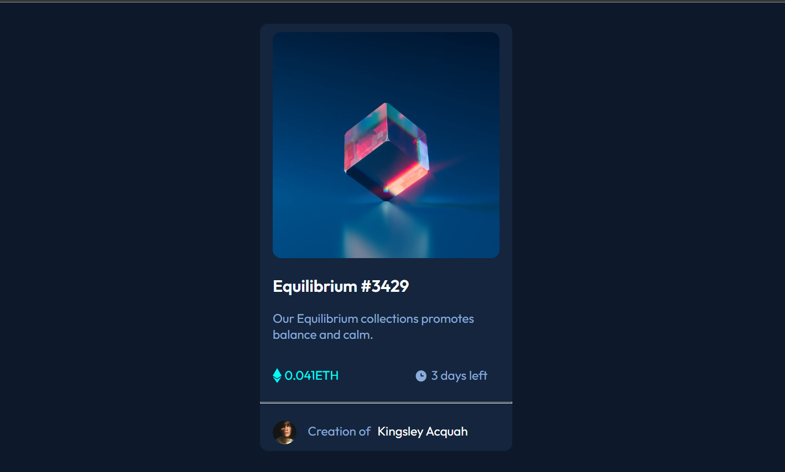

# Frontend Mentor - NFT preview card component solution

This is a solution to the [NFT preview card component challenge on Frontend Mentor](https://www.frontendmentor.io/challenges/nft-preview-card-component-SbdUL_w0U). Frontend Mentor challenges help you improve your coding skills by building realistic projects. 

## Table of contents

- [Overview](#overview)
  - [The challenge](#the-challenge)
  - [Screenshot](#screenshot)
  - [Links](#links)
- [My process](#my-process)
  - [Built with](#built-with)
  - [What I learned](#what-i-learned)
  - [Continued development](#continued-development)
  - [Useful resources](#useful-resources)
- [Author](#author)
- [Acknowledgments](#acknowledgments)

**Note: Delete this note and update the table of contents based on what sections you keep.**

## Overview
This project is simple preview card with few interactive states.
How the project was to be built is specified under the challenge sub-section.
A screenshot of both challenge requirement and solution i built will be provided in the screenshot sub-section.
Links to solutions are also available under the links sub-section.

### The challenge

Users should be able to:

- View the optimal layout depending on their device's screen size
- See hover states for interactive elements

### Screenshot



### Links

- Solution URL: [Solution URL](https://github.com/Acquah-Kingsley-Segu/Frontend-Mentor-NFT-Preview)
- Live Site URL: [Live Site](https://acquah-kingsley-segu.github.io/Frontend-Mentor-NFT-Preview/)

## My process

### Built with

- Semantic HTML5 markup
- CSS basics

### What I learned

```html
<h1>The importance of semantics in html and how to section codes to suit semantics</h1>
<a href="https://hackernoon.com/how-to-write-semantic-html-dkq3ulo">Resource</a>
```
```css
.how-to-vertically-align-text-with-image {
  vertical-align: middle;
}
```
[Resource](https://developer.mozilla.org/en-US/docs/Web/CSS/vertical-align#vertical_alignment_in_a_line_box)

###
Makng it responsive at all screen levels
### Useful resources

- [For HTML Sematics](https://hackernoon.com/how-to-write-semantic-html-dkq3ulo) - This helped me realize the importance of semantics in html.
- [CSS image-text alignment](https://developer.mozilla.org/en-US/docs/Web/CSS/vertical-align#vertical_alignment_in_a_line_box) - This is an amazing article which helped me know how to vertically center a text with an image.

## Author

- Frontend Mentor - [@Acquah-Kingsley-Segu](https://www.frontendmentor.io/profile/Acquah-Kingsley-Segu)

